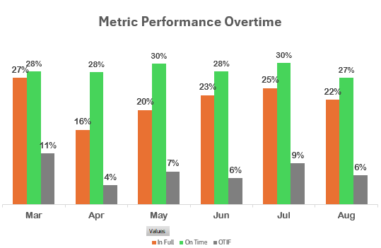

# Mart-Business-Analysis

## Introduction
I analyzed a dataset from codebasics.io about a business named Atiliq Mart. AtliQ Mart is a growing FMCG manufacturer headquartered in Gujarat, India. It is currently operational in three cities: Surat, Ahmedabad, and Vadodara. They want to expand to other metros/Tier 1 cities in the next 2 years.
AtliQ Mart is currently facing a problem where a few key customers have not extended their annual contracts due to service issues. It is speculated that some of the essential products were either not delivered on time or not delivered in full over a continued period, which could have resulted in bad customer service. Management wants to fix this issue before expanding to other cities and requested their supply chain analytics team to track the ’On time’ and ‘In Full’ delivery service level for all the customers daily basis so that they can respond swiftly to these issues.
## Tech Stack 
Excel, Power Query and Power Pivot
## Data Cleaning
After importing my data into power query, I checked for duplicates(found none),the validity of my data using column distribution, quality and profiling and removed columns not neccessary for my analysis. I also made sure my columns were in the right data type.
## Data Preprocessing
I noticed there was no column for Volume Fill Rate, in the Order Lines Table, so I created the column for Volume Fill Rate, which was Quantity Delivered/Quantity Ordered.
## Data Analysis & Visualizations

Acclaimed Stores , Lotus Mart and CoolBlue have the lowest on time delivery rate, that is, longest On-time delivery, in essence, if they find a client who delivers at a shorter time, they won't hesistate to drop the contract with Atiliq Mart 

Elite Mart, Sorefoz Mart, info stores, Vijay Stores have the lowest  in-full delivery rate.

### In essence, Atiliq Mart is on the verge of loosing Coolblue as a client due to the extremely poor delivery service which includes taking so long to deliver, as well as not delivering the full quantity.

Clients that Atiliq Mart works towards delivering orders in full are not always delivered on time, while Clients that are delivered to on-time, the rate at which orders are delivered in-full is below average

Surat has the best Metric performance with the best delivery in August, but also the lowest Orders

Most of the poor delivery service for Coolblue is found in Vadodara with better delivery service in full in Ahmedabad  

Vadora has the poorest metric performance of the the 3 cities which shows where clients that will end their contracts with Atiliq Mart will come from

[view the dashboard here]()
